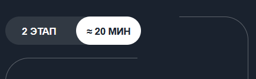
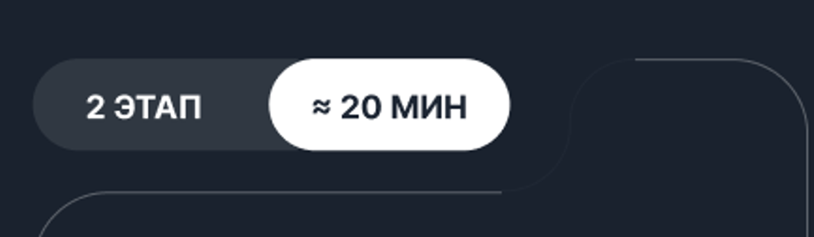
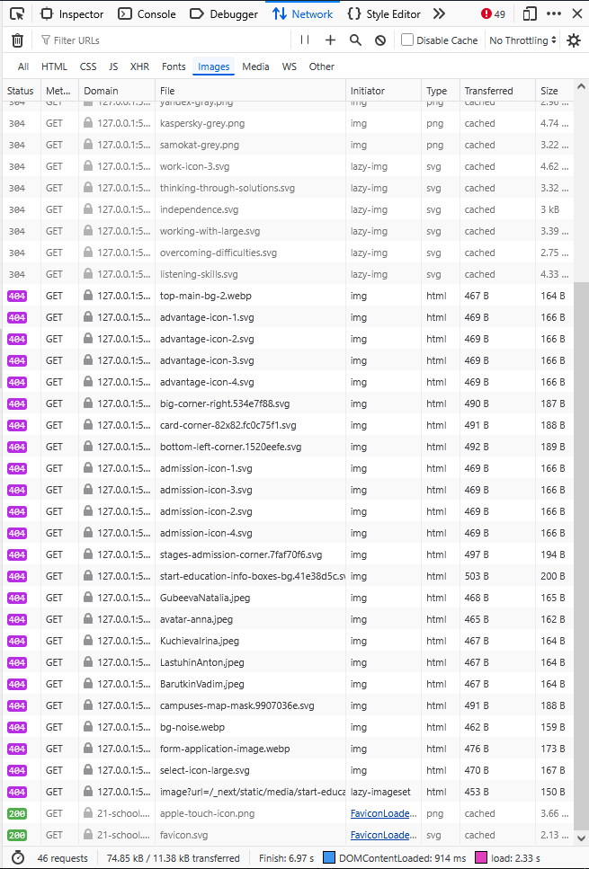

# Баг-репорт: Несоответствие верстки макету (Pixel Perfect)

**ID:** BUG-001  
**Компонент:** Вёрстка сайта  
**Среда:** Браузер Chrome 126.0 + расширение "Pixel Perfect Pro"  
**Приоритет:** P4 (Minor)  
**Серьёзность:** Medium

## Описание

При сравнении вёрстки сайта с макетом в Figma через расширение **Pixel Perfect Pro** выявлены отклонения множества блоков от шаблона. Расположение и размеры элементов частично не совпадают с макетом, однако общая структура сайта сохраняется.

## Шаги воспроизведения

1. Открыть сайт в браузере Chrome.
2. Включить расширение **Pixel Perfect Pro**.
3. Загрузить макет из Figma.
4. Сравнить вёрстку и макет в режиме наложения.

## Фактический результат

- Отступы и размеры ряда блоков отличаются от макета.
- Элементы немного смещены относительно шаблона.

## Ожидаемый результат

- Все элементы вёрстки совпадают с макетом Figma по pixel perfect стандарту (отступы, размеры, позиционирование).

## Скриншоты / Приложения

# Баг-репорт: Некорректное отображение блока слайдера (swiper-slide)

**ID:** BUG-002  
**Компонент:** Вёрстка — блоки слайдера (swiper-slide)  
**Среда:** Chrome 126.0, Windows 10  
**Приоритет:** P4 (Minor)  
**Серьёзность:** Medium

## Описание

Блоки внутри слайдера (`swiper-slide`) отображаются с некорректным скруглением и позиционированием относительно друг друга. Вёрстка не совпадает с макетом Figma: элементы смещены и выглядят визуально «криво».

## Шаги воспроизведения

1. Открыть сайт в браузере Chrome.
2. Перейти к блоку слайдера (swiper).
3. Сравнить отображение элементов с макетом в Figma.

## Фактический результат

- Скругления блоков отличаются от макета.
- Белый и тёмный блоки смыкаются не так, как в шаблоне.
- Визуально создаётся эффект кривого отображения.

## Ожидаемый результат

- Скругления и позиционирование блоков должны соответствовать макету в Figma.
- Белый и тёмный блоки должны стыковаться плавно, без визуальных искажений.

## Скриншоты

- **Вёрстка:**  
  

- **Макет Figma:**  
  

# Баг-репорт: Изображения не отображаются из-за несоответствия названий файлов

**ID:** BUG-003  
**Компонент:** Вёрстка — статические ресурсы (изображения)  
**Среда:** Chrome 126.0, Windows 10  
**Приоритет:** P3 (Major)  
**Серьёзность:** High

## Описание

В папке с вёрсткой названия изображений не соответствуют названиям, указанным в коде HTML/CSS. В результате при рендере страницы часть изображений не подгружается.

## Шаги воспроизведения

1. Открыть сайт в браузере.
2. Перейти к блокам, где должны отображаться изображения.
3. Проверить ошибки в DevTools → вкладка _Network_ / _Console_.

## Фактический результат

- На странице отсутствует ряд изображений.
- В консоли браузера отображаются ошибки `404 (Not Found)` при попытке загрузки файлов.

## Ожидаемый результат

- Все изображения успешно загружаются и отображаются на странице.
- Названия файлов в папке должны соответствовать названиям, указанным в коде вёрстки.

## Скриншоты / Приложения

