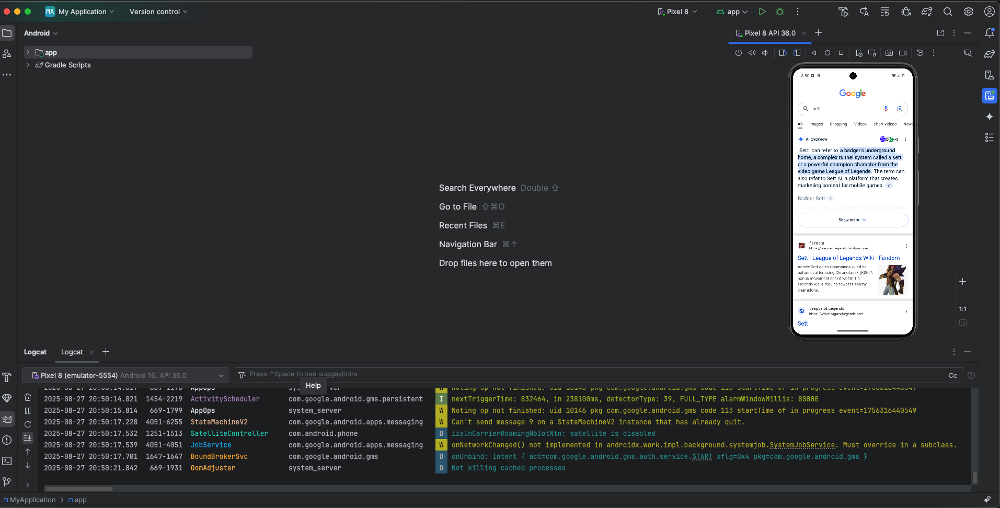

# Задание 3. Работа с Android Studio

## Пошаговая инструкция по установке Android Studio, созданию эмулятора **с поддержкой Play Market**, включению режима разработчика на эмуляторе, работе с **Logcat**, а также созданию эмулятора в **Xcode (iOS Simulator)**.

---

## 1 Установка Android Studio

**Кратко:** скачайте Android Studio с сайта разработчиков, установите, затем при первом запуске установите SDK и нужные системные образы.

**Шаги:**
1. Перейдите на официальный сайт Android Studio и скачайте установщик для вашей ОС.
2. Запустите установку. На шаге компонентов оставьте галочки: **Android SDK**, **Android SDK Platform-Tools**, **Android Emulator**.
3. Откройте Android Studio → при первом запуске мастер предложит:
   - выбрать **Standard** (рекомендуется);
   - загрузить последние SDK/инструменты;
   - указать директорию SDK (по умолчанию подходит).
4. После установки откройте **SDK Manager** (значок шестерёнки в правом верхнем углу → *SDK Manager*):
   - Вкладка **SDK Platforms**: отметьте последнюю стабильную версию Android (напр., Android 14/15).
   - Вкладка **SDK Tools**: убедитесь, что включены **Android SDK Platform-Tools**, **Android Emulator**, опционально **Intel x86/ARM 64 System Images** и **Android SDK Build-Tools**.
5. Нажмите **Apply** → дождитесь загрузки компонентов.

> Примечания: на Windows потребуется включённая виртуализация (BIOS/UEFI). На macOS используется Hypervisor Framework. На Linux — KVM.

---

## 2 Эмулятор Android с поддержкой **Play Market**

Чтобы эмулятор имел **Play Store**, нужно выбрать системный образ с значком **Google Play** 

**Шаги:**
1. Откройте **Device Manager**:  
   - На экране приветствия Android Studio: **More Actions → Virtual Device Manager**;  
   - Или в открытом проекте: **View → Tool Windows → Device Manager**.
2. Нажмите **+ Create device** (или **Create Virtual Device**).
3. Выберите профиль устройства (например, **Pixel 6/7**), нажмите **Next**.
4. На шаге **System Image** выберите образ **с бейджем _Google Play_** (например: *Android 14 — Google Play (ARM64)*). Если не видите — перейдите во вкладку **Other Images** или нажмите **Download** напротив подходящего образа.
5. Нажмите **Next** → при необходимости настройте параметры (имя AVD, ориентация, память, графика Auto/Hardware) → **Finish**.
6. В списке устройств убедитесь, что у AVD стоит поле **Play Store: Yes** или виден значок Play Store. Запустите эмулятор (**▶**). Внутри эмулятора войдите в **Play Store** под аккаунтом Google (если требуется).

### Примеры скриншотов

---

## 3 Включение режима разработчика (Developer options) на эмуляторе

1. Запустите эмулятор Android.  
2. Откройте **Settings → About emulated device → Build number**.  
3. Нажмите 7 раз на пункт **Build number**, пока не появится сообщение «You are now a developer!».  
4. В меню настроек появится новый раздел: **System → Developer options**.

### Примеры скриншотов

---

## 4 Logcat в Android Studio — снятие/фильтрация логов

**Открыть Logcat:**
- **View → Tool Windows → Logcat** (или кнопка *Logcat* снизу IDE).

**Быстрый практикум:**
1. Запустите ваше приложение на эмуляторе (кнопка **Run ▶**).
2. В окне **Logcat**:
   - Выберите устройство/AVD (в выпадающем списке слева).
   - В поле поиска укажите фильтр по пакету (**Package: your.app.id**) или по уровню (**Verbose/Debug/Info/Warn/Error**).
   - Используйте быстрые фильтры: *Only Show Selected App*, *Regex* и т. д.
3. Для экспорта логов нажмите **Save/Export** (значок сохранения) и выберите файл.  
  

### Примеры скриншотов

---

## 5 Эмулятор в Xcode (iOS Simulator): пошагово

> Требуется macOS и установленный **Xcode**.

1. Установите Xcode из **App Store** (или с сайта Apple). Запустите Xcode и при первом старте установите дополнительные компоненты.
2. Откройте меню **Window → Devices and Simulators**.
3. Перейдите на вкладку **Simulators** и нажмите **+** в левом нижнем углу.
4. В окне **Create a new simulator** выберите:
   - **Device Type** (например, *iPhone 15*),
   - **iOS Version / Runtime** (если нужной версии нет — скачайте соответствующий **iOS Simulator runtime** в **Xcode → Settings → Platforms**).
   - задайте **Name** (произвольное).
5. Нажмите **Create**. Новый симулятор появится в списке — выберите его и нажмите **Open Simulator** (или просто запустите проект, выбрав этот симулятор как целевое устройство).

